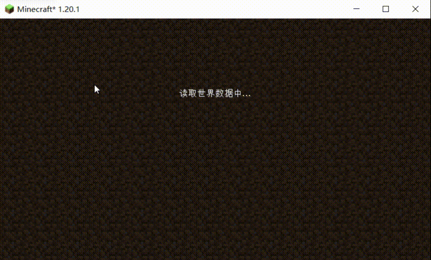
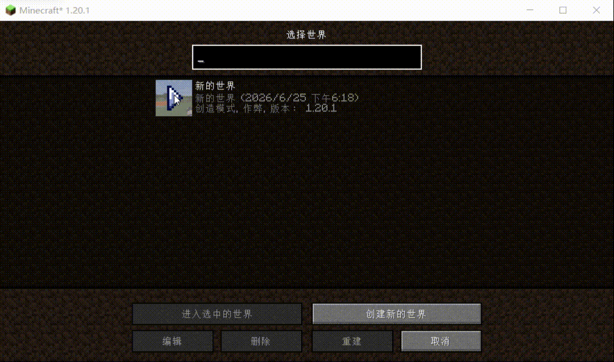

# Create Download Genshin

> 检测到机械动力（Create）模组后，进入世界自动弹出"原神下载"弹窗的恶搞模组

[](https://www.minecraft.net/)
[](https://fabricmc.net/)
[](https://kotlinlang.org/)
[](LICENSE)

**🌐 语言: [English](README_EN.md) | [中文](README.md) | [日本語](README_JA.md) | [한국어](README_KO.md) | [Русский](README_RU.md)**

---

## 目录

- [功能介绍](#功能介绍)
- [安装要求](#安装要求)
- [安装步骤](#安装步骤)
- [配置说明](#配置说明)
- [项目结构](#项目结构)
- [技术实现](#技术实现)
- [常见问题](#常见问题)
- [构建](#构建)
- [开发说明](#开发说明)
- [许可证](#许可证)
- [免责声明](#免责声明)

---

## 功能介绍

### 前置条件

本模组**仅在检测到已安装机械动力（Create）模组时才会激活**。如果未安装 Create，模组将完全静默，不会执行任何操作。

### 模式一：恶搞虚假下载模式（默认）

进入世界的瞬间，自动弹出一个仿高危系统警告的下载弹窗：



- 红色警告边框 + 红色标题栏显示"系统紧急警告"
- 青色提示文字"检测到您已安装机械动力（Create）模组"
- 8条恐怖中文文案每5秒轮播：
  - "警告：检测到您的电脑未安装《原神》！"
  - "系统正在强制下载原神安装包...请勿关闭电脑"
  - "请勿关闭此窗口，否则可能导致系统文件损坏！"
  - "您的电脑将被强制绑定米哈游账号，无法解绑"
  - "正在修改系统注册表...请勿断开电源"
  - ...
- 可视化进度条颜色随进度变化：绿 → 黄 → 橙 → 红
- **8%概率进度回退**，模拟网络卡顿
- **进度永远锁定在99%**，永远不会到100%
- 伪造的文件信息："原神安装包 v5.0.0 - 23.8 GB"
- 伪造的剩余时间倒计时
- 用户可随时点击"关闭下载"按钮或按ESC关闭弹窗

### 模式二：真实下载模式（配置开启后）

修改配置文件开启后，弹窗变为真正的下载管理器：



- 蓝色边框专业下载界面
- 青色提示文字"检测到您已安装机械动力（Create）模组"
- 异步后台线程下载指定URL文件，**绝不阻塞游戏主线程**
- 实时显示：下载百分比、已下载/总大小、下载速度（KB/s）、预计剩余时间
- 边框颜色随状态变化：蓝色（下载中）→ 绿色（完成）→ 红色（失败）
- 下载完成后自动调用系统程序打开安装包（跨平台支持 Windows/macOS/Linux）
- 网络超时（15秒连接/30秒读取）、文件权限不足、下载失败时弹出游戏内错误提示
- 支持取消下载

---

## 安装要求

| 依赖 | 版本 | 必需 | 说明 |
|------|------|:----:|------|
| Minecraft | 1.20.1 | 是 | 游戏本体 |
| Fabric Loader | >= 0.19.3 | 是 | 模组加载器 |
| Fabric API | 0.92.9+1.20.1 | 是 | Fabric核心API |
| Fabric Language Kotlin | 1.13.12+kotlin.2.4.0 | 是 | Kotlin语言支持 |
| [Create（机械动力）](https://modrinth.com/mod/create) | 任意 1.20.1 版本 | **是** | **本模组检测此模组后才会激活** |
| Java | >= 17 | 是 | 运行环境 |

> **重要：** 本模组通过 `FabricLoader.getInstance().isModLoaded("create")` 检测 Create 模组。未安装 Create 时，模组加载但不会执行任何操作，不会影响游戏性能。

---

## 安装步骤

1. 安装 [Fabric Loader](https://fabricmc.net/use/installer/)（如果尚未安装）
2. 下载并安装 [Fabric API](https://modrinth.com/mod/fabric-api) → 放入 `.minecraft/mods/`
3. 下载并安装 [Fabric Language Kotlin](https://modrinth.com/mod/fabric-language-kotlin) → 放入 `.minecraft/mods/`
4. 下载并安装 [Create（机械动力）](https://modrinth.com/mod/create) → 放入 `.minecraft/mods/`
5. 将本模组的 `create-download-genshin-1.0.0.jar` 放入 `.minecraft/mods/`
6. 启动游戏，进入任意世界即可看到弹窗

---

## 配置说明

模组首次启动会自动生成配置文件。配置文件损坏或字段缺失时自动恢复默认值。

**配置文件路径：**
```
.minecraft/config/create-download-genshin/mod_config.json
```

### 默认配置

```json
{
  "enableRealDownload": false,
  "downloadUrl": "https://ys-api.mihoyo.com/event/download_porter/link/ys_cn/official/pc_backup320",
  "downloadFileName": "yuanshen.exe"
}
```

### 参数说明

| 参数 | 类型 | 默认值 | 说明 |
|------|------|--------|------|
| `enableRealDownload` | Boolean | `false` | `false` = 恶搞模式（默认），`true` = 真实下载模式 |
| `downloadUrl` | String | 米哈游API | 真实下载模式的目标URL，仅在 `enableRealDownload=true` 时生效 |
| `downloadFileName` | String | `yuanshen.exe` | 下载文件保存时的文件名，仅在 `enableRealDownload=true` 时生效 |

### 切换模式

1. **关闭游戏**
2. 编辑 `.minecraft/config/create-download-genshin/mod_config.json`
3. 修改 `enableRealDownload` 为 `true`（如需自定义下载链接，同时修改 `downloadUrl`）
4. 保存文件
5. **重启游戏**（模式修改需要重启才能生效）

---

## 多语言支持

本模组支持以下语言，会自动跟随游戏语言设置切换：

| 语言 | 语言代码 | 状态 |
|------|----------|:----:|
| 简体中文 | `zh_cn` | 完整支持 |
| English | `en_us` | 完整支持 |
| 日本語 | `ja_jp` | 完整支持 |
| 한국어 | `ko_kr` | 完整支持 |
| Русский | `ru_ru` | 完整支持 |

> 所有界面文字（标题、按钮、提示信息、时间格式等）均已实现本地化。

---

## 项目结构

```
src/
├── main/                                    # common通用源码（客户端+服务端）
│   ├── kotlin/com/tututeam/create_download_genshin/
│   │   ├── CreateDownloadGenshin.kt         # 模组主入口（初始化配置、数据目录）
│   │   ├── config/
│   │   │   └── ModConfig.kt                 # 配置管理（JSON读写、自动恢复、线程安全）
│   │   └── util/
│   │       ├── FileUtil.kt                  # 文件工具（数据目录、路径、字节格式化）
│   │       └── DownloadUtil.kt              # 异步下载（CompletableFuture + HttpURLConnection）
│   └── resources/
│       ├── assets/create-download-genshin/
│       │   ├── lang/
│       │   │   ├── zh_cn.json               # 中文本地化
│       │   │   └── en_us.json               # 英文本地化
│       │   └── icon.png                     # 模组图标
│       ├── create-download-genshin.mixins.json
│       └── fabric.mod.json                  # 模组描述文件
│
└── client/                                  # 客户端专属源码（不会在服务端加载）
    ├── kotlin/com/tututeam/create_download_genshin/client/
    │   ├── CreateDownloadGenshinClient.kt   # 客户端入口（注册事件监听）
    │   ├── event/
    │   │   └── ClientEvents.kt              # 事件监听（Create检测 + 世界进入触发）
    │   └── gui/
    │       ├── FakeDownloadScreen.kt        # 恶搞弹窗（进度锁定99%、文案轮播）
    │       └── RealDownloadScreen.kt        # 真实下载（进度/速度/ETA、自动打开）
    └── resources/
        └── create-download-genshin.client.mixins.json
```

### 源码集职责划分

| 源码集 | 加载环境 | 包含内容 | 可调用API |
|--------|----------|----------|-----------|
| `main` (common) | 客户端 + 服务端 | 配置管理、文件工具、下载工具 | 仅Java/Kotlin标准库、Fabric Loader API |
| `client` | 仅客户端 | 事件监听、GUI弹窗 | Minecraft客户端API、Fabric客户端API |

---

## 技术实现

### 核心机制

| 机制 | 实现方式 |
|------|----------|
| **Create检测** | `FabricLoader.getInstance().isModLoaded("create")` |
| **触发时机** | `ClientPlayConnectionEvents.JOIN` 事件（玩家成功连接世界时） |
| **线程调度** | `client.execute {}` 延迟到主线程弹出GUI |
| **异步下载** | `CompletableFuture.runAsync` 后台线程执行 |
| **HTTP请求** | Java内置 `HttpURLConnection`（无需额外依赖） |
| **进度传递** | `AtomicLong` / `AtomicBoolean` 线程安全读写 |
| **空安全** | Kotlin `?.`、`?:`、`coerceIn` 等空安全语法 |
| **异常捕获** | 所有IO/网络/文件操作均有 `try-catch` |

### 恶搞模式进度条算法

```kotlin
// 每8~20帧更新一次（模拟极慢网速，约0.4~1秒更新一次）
val updateInterval = 8 + random.nextInt(13)
if (tickCount % updateInterval != 0) return

// 计算本次进度变化量
val delta = if (random.nextDouble() < 0.08) {
    // 8%概率回退 0.05%~0.15%（模拟网络卡顿）
    -(0.0005 + random.nextDouble() * 0.001)
} else {
    // 92%概率递增 0.03%~0.12%
    0.0003 + random.nextDouble() * 0.0009
}

// 硬上限锁99%，永远到不了100%
progress = (progress + delta).coerceIn(0.0, 0.99)
```

### 事件流程

```
游戏启动
  └→ CreateDownloadGenshin.onInitialize()
       ├→ ModConfig.init()          // 加载/创建配置
       └→ FileUtil.initDataDir()    // 初始化数据目录

  └→ CreateDownloadGenshinClient.onInitializeClient()
       └→ ClientEvents.register()   // 注册JOIN事件监听

玩家进入世界
  └→ ClientPlayConnectionEvents.JOIN 触发
       └→ client.execute {
            └→ showDownloadScreen()
                 ├→ isCreateModLoaded()  // 检测Create
                 │    └→ false → 静默返回，不做任何操作
                 └→ true → 根据配置弹出对应GUI
                      ├→ FakeDownloadScreen（恶搞模式）
                      └→ RealDownloadScreen（真实模式）
                          └→ DownloadUtil.downloadAsync()  // 后台下载
```

---

## 常见问题

### Q: 弹窗没有出现？

1. **确认已安装机械动力（Create）模组** — 本模组仅在检测到 Create 时才会弹出弹窗
2. 确认本模组 `.jar` 文件在 `.minecraft/mods/` 目录下
3. 确认已安装 `fabric-api` 和 `fabric-language-kotlin`
4. 检查游戏日志（`.minecraft/logs/latest.log`）中是否有以下输出：
   - `未检测到机械动力模组（Create），跳过弹窗` → 说明未安装 Create
   - `已检测到机械动力模组（Create），准备弹出下载窗口` → 说明检测成功

### Q: 真实下载模式提示"下载失败"？

- 检查网络连接是否正常
- 确认 `downloadUrl` 地址可访问（可在浏览器中测试）
- 检查是否有防火墙/代理拦截
- 查看 `.minecraft/logs/latest.log` 获取详细错误信息
- 常见错误码：`403`（权限不足）、`404`（链接失效）、`timeout`（网络超时）

### Q: 如何修改下载链接？

编辑配置文件中的 `downloadUrl` 字段，保存后重启游戏即可。

### Q: 会修改我的系统文件吗？

**不会。** 恶搞模式的弹窗纯视觉效果，不执行任何实际操作。真实下载模式只会将文件保存到 `.minecraft/create-download-genshin-data/` 目录，不会修改系统文件。

### Q: 服务端会崩溃吗？

**不会。** 所有客户端专属代码（GUI、事件监听、Create检测）都在 `client` 源码集中，不会在服务端加载。服务端只加载配置管理和文件工具类，不包含任何客户端API调用。

### Q: 弹窗打开时游戏会暂停吗？

**不会。** 两个弹窗都重写了 `isPauseScreen()` 返回 `false`，弹窗打开时游戏世界继续运行。

### Q: 可以不安装 Create 直接使用吗？

不可以。本模组的设计目的就是针对 Create 用户的恶搞，未安装 Create 时模组完全静默。

---

## 构建

### 前置要求

- JDK 17+
- 网络连接（首次构建需要下载依赖）

### 编译

```bash
# 克隆仓库
git clone https://github.com/wututua/Create_Download_Genshin_Fabric.git
cd create-download-genshin

# 编译（Linux/macOS）
./gradlew build

# 编译（Windows）
gradlew.bat build

# 输出文件
# build/libs/create-download-genshin-1.0.0.jar      ← 可直接放入 mods/
# build/libs/create-download-genshin-1.0.0-sources.jar ← 源码包
```

### 测试

```bash
# 启动测试客户端
./gradlew runClient
```

---

## 开发说明

### 环境搭建

1. 安装 JDK 17+
2. Fork 并克隆本仓库
3. 使用 IntelliJ IDEA 打开项目（推荐，自动识别 Gradle 项目）
4. 等待 Gradle 同步完成（首次需要下载依赖）
5. 运行 `./gradlew runClient` 启动测试客户端

### 代码规范

- Kotlin 严格空安全语法，禁止滥用 `!!`
- 所有公共 API 附带 KDoc 中文注释
- IO/网络操作必须 `try-catch`，异常信息写入日志
- 客户端代码禁止出现在 common 包（防止服务端崩溃）
- GUI 弹窗必须重写 `isPauseScreen()` 返回 `false`

### 贡献

欢迎提交 Issue 和 Pull Request。详见 [CONTRIBUTING.md](CONTRIBUTING.md)。

---

## 更新日志

详见 [CHANGELOG.md](CHANGELOG.md)。

---

## 许可证

本项目基于 [MIT License](LICENSE) 开源。

---

## 致谢

- [Fabric](https://fabricmc.net/) — Minecraft 模组加载器
- [Fabric API](https://github.com/FabricMC/fabric) — Fabric 核心 API
- [Fabric Language Kotlin](https://github.com/FabricMC/fabric-language-kotlin) — Kotlin 语言支持
- [Create](https://modrinth.com/mod/create) — 机械动力模组
- [Minecraft](https://www.minecraft.net/) — 游戏本体

---

## 免责声明

本模组仅供学习交流和娱乐用途。恶搞模式的弹窗仅为视觉恶作剧，不会对您的电脑造成任何实际影响。请勿将本模组用于恶意目的。使用本模组即表示您同意自行承担使用风险。
